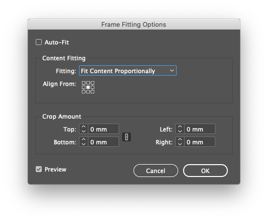

- [Batch import & place images by the number in filename.jsx](#batch-import--place-images-by-the-number-in-filenamejsx)
  - [Examples](#examples)
  - [Basic usage](#basic-usage)
  - [Default options](#default-options)
  - [Master page templates (position & size)](#master-page-templates-position--size)
    - [Using templates (position)](#using-templates-position)
      - [Using template divisions](#using-template-divisions)
    - [Frame fitting (size)](#frame-fitting-size)
  - [Graphic frame styling](#graphic-frame-styling)
  - [Automatic master page template and division layer creation](#automatic-master-page-template-and-division-layer-creation)

____
____


# Batch import & place images by the number in filename.jsx

The script places all files from the input folder and its sub folders into the document based on the number prefix in the filename. For example: `input folder/100 my file.pdf` is placed on the page `100`. The regex for finding this number is customizable. This is the minimal setup. 

I've done a partial and a complete re-write of this script multiple times over several years, mostly because it started out as a very rigid script that was written for a very specific scenario. I don't know if anyone will have much use for this, I certainly don't anymore, but I felt like doing a cleaner and more flexible version of the script for my own amusement, if nothing else. This was originally a script for Indesign CS3, but I've rewritten it in CC 2019 and I wouldn't trust it to work on anything below CC or CS6.

> If you have a multi page pdf, you might be better off using the `MultiPageImporter` script instead. Though that said, you can split pages in Acrobat reader in a way that it prefixes the filenames with a number and that is also relatively simple to batch rename afterwards if needed. You should also probably look into XML imports in case that is a better option.

## Examples

The examples folder in the repo has `idml` files that you can just open and run the script on.

## Basic usage

1. Make sure your files have a number prefix:
  - `input folder/1 file.pdf`
  - `input folder/02 file.pdf`
  - `input folder/03 file.pdf`
  - `input folder/10 file.pdf`
2. Run the script
3. Select input folder

In this scenario input files would end up on pages `1,2,3,10`. Also, they'd all be centered in the document and not resized. Read more about setting the position and size below: [Master page templates (position & size)](#master-page-templates-position--size).

## Default options

You can find these at the top of the script file.

```js
var customization = {
  allowMissingNumbers: false, // Permanently ignores files that don't have numbers in them
  inputFormats: 'tiff?|gif|jpe?g|bmp|eps|svg|png|ai|psd|pdf',
  templateRegex: "@.*?$", // Matches everything starting from "@". Filenames do not include extensions. https://regex101.com/r/MgiHaQ/1
  templateDivisionRegex: "#.*?$", // This is exactly the same as above, but just using the "#" character
  filePageNumberRegex: "^\\d*", // Matches leading number https://regex101.com/r/WqlhXS/1 (since these are strings, you need to double up the backslashes)
  showPage: true, // Whether or not to show each page when placing files. 
  showPageZoomOut: 0, // If "showPage" is true, zoom out this amount of times. 0 = fit page to window.
  showPageDelay: 0, // Milliseconds. Additional delay if you reaaaaaaally want to linger on the page after the file has been placed.
  pdfCrop: ['cropTrim', 'cropBleed', 'cropPDF', 'cropMedia'], // PDF crop fallback order
  pdfTransparentBackground: true,
};
```

## Master page templates (position & size)

You can set position and size by using `master pages` as templates. Basically you draw a graphic frame where you want the images to land and in the file name or folder name use an identifier that determines which template the images will use. You don't need to use a templates if you want all images to center themselves on the page and to use the original size.

> If you run the script without any master page templates or division layers, the script will offer to create them automatically. It will also inform you if any files are missing page numbers, which you can choose to temporarily ignore, in which case they won't be placed.

### Using templates (position)

> Optional

These templates are not used as traditional master pages, they contain graphic frame(s) that are copied over to the page(s) as needed, so they don't ovewrite the page master page or anything.

1. Put a template identifier `@` in the filename or any of it's parent folders (up to the input folder).
	- The closest template name is used.
	- By default it and everything that follows is matched
		- `input folder/sub folder @A-Master/01 file.pdf` - **Template:** `@A-Master`
		- `input folder @-template-1/sub folder/02 file.pdf` - **Template:** `@-template-1`
		- `input folder/sub folder/02 file.pdf` - **Template:** `N/A` - File is centered on the page.
		- `input folder/03 file @-template-2.pdf` - **Template:** `@-template-2`
			- In files the extension is always omitted
2. Make new master page(s) that correspond the template names used in the input folder
	- You can make these manually, but the easier way is to run the script once and let the script create the needed master page templates
	- Template names match the full master page name and they always include a prefix that is separated from the rest of the name with a dash: Template: `@A-Master` → Master page prefix: `@A` Master page name: `Master`
3. Add at least one graphic frame per (master) page. This is where the image will be placed.
   - If you are using facing pages and want the left side and the right side to have identical positioning, you can remove one of the pages in the master.
   - Template master pages should only contain the graphic frames you want to use for the input files and nothing else. 

#### Using template divisions

> Optional

With divisions you can set multiple positions in a single master page template. The gist of it is, you make multiple graphic frames inside the master page and put them inside layers to tell the files which division/graphic frame to use and you need to use a division identifier on the files or folders to.

0. Division always needs to have a parent template
1. Just like templates, divisions use the `#` identifier in the filename or parent folders.
	- The closest division name is used.
	- By default it and everything that follows is matched
		- `input folder/sub folder @A-Master/01 file #division-1.pdf` - **Template:** `@A-Master` **Division:** `#division-1`
		- `input folder @-template-1/sub folder #division-2/02 file.pdf` - **Template:** `@-template-1`**Division:** `#division-2`
		- `input folder/sub folder/02 file.pdf` - **Template:** `N/A` - **Division:** `N/A` - File is centered on the page.
		- `input folder @-template-2/03 file #division-1.pdf` - **Template:** `@-template-2` **Division:** `#division-1`
2. Make new layer(s) that correspond the division names used in the input folder
	- You can make these manually, but the easier way is to run the script once and let it create the needed division layers
3. Move graphic frames to each division layer as needed.


### Frame fitting (size)

> Optional

By default the files use their original size, but when they honor the fitting options of their graphic frame. So before running the script you can prepare the graphic frames to for eaxample fit all graphics proportionally. You do it by selecting the graphic frame(s) on the master page and fiddle with the options at: `Object > Fitting > Frame fitting options...` or `Right click on the document > Fitting > Frame fitting options...`. In here you also have some control over the image position within the graphic frame. 

> FYI: `Window > Styles > Object styles...` has frame fitting options too.



## Graphic frame styling

> Optional

Styling background color and borders in the template graphic frames carries over to the page when the file is placed, as long as the image doesn't cover it, but you'll likely want to use a transparent background and borders.

## Automatic master page template and division layer creation

You can prepare the files with template and division identifiers and if you run the script before setting up anything in the indesign file, you will basically be greeted with an error log that has some checkboxes to help create the necessary master page templates and division layers. You still have to create the graphic frames on your own. 
